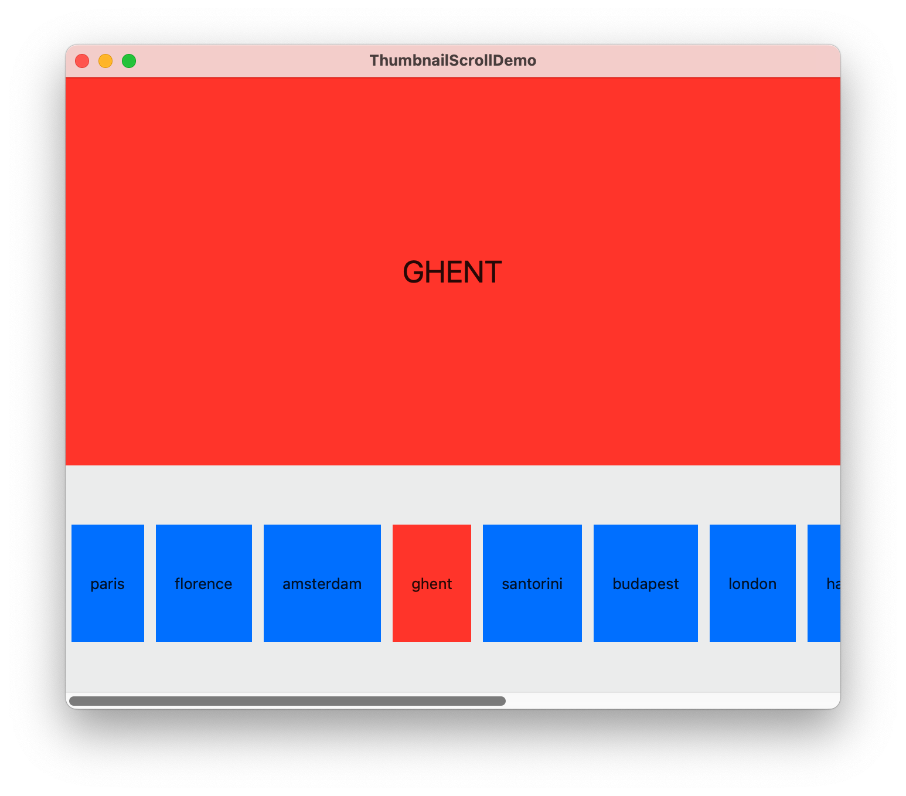
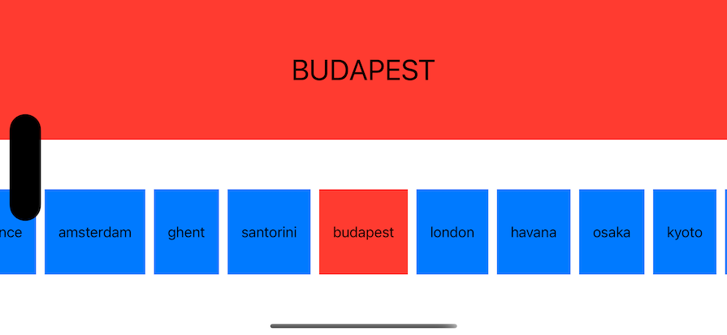

#  ThumbnailScrollDemo

Imitation of the Photos app browse mode. Horizontally scrolling thumbnails, with detail view above the scrollview. SwiftUI and Bindings exercise. Tested on macOS, iOS, visionOS. 

Follows the concepts of https://developer.apple.com/tutorials/swiftui-concepts/driving-changes-in-your-ui-with-state-and-bindings, but this is a vertical layout, not a horizontal layout. Imagine a `NavigationSplitViewController` that’s laid out vertically instead of horizontally. 

The thumbnail and detail views are quite primitive. They're meant as simple examples.

For the detail view: we have a detail wrapper that accepts a binding to an item (a notional `City`). The detail wrapper performs a lookup of the item binding ID, and shows a detail view that accepts an actual item/`City`).

